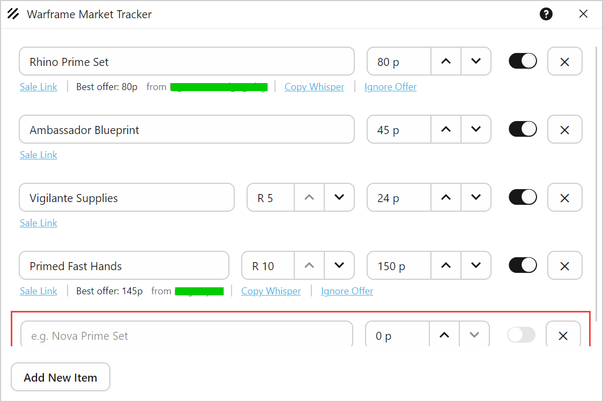
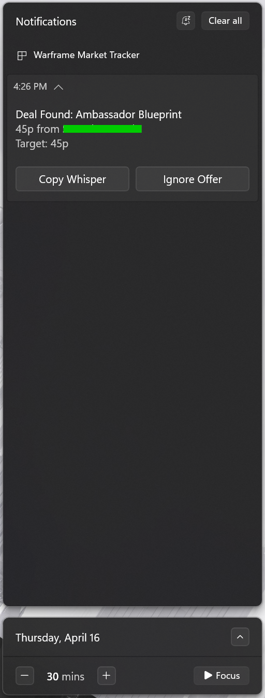

# Warframe Market Tracker

[](#)
[](#)
[](#)

[](https://github.com/Huntk23/WarframeMarketTracker/actions)
[](https://github.com/Huntk23/WarframeMarketTracker/releases/latest)
[](https://github.com/Huntk23/WarframeMarketTracker/releases)

---

A lightweight desktop app that watches personally selected [warframe.market](https://warframe.market) item prices in the background and pings you when a deal hits your target — so you don't have to constantly refresh the sellers’ tab or wait on a seller to click on the buyer tab; because unfortunately, _we all know_ buying a deal is better than waiting for a deal to come to you.

## Preview





## What it does

- **Track items by name** — search from the full [warframe.market](https://warframe.market) item catalog with autocomplete
  - **Persistence** — the app will save and restore the items you are tracking automatically during the app session and on close
- **Set your price** — pick a platinum threshold per item, optionally filter by mod rank
- **Get notified** — cross-platform native notification when an in-game seller lists at or below your target
  - **Sales link** — open the tracked items sale page
  - **Copy the whisper** — one click on the notification copies the `/w` trade message to your clipboard, ready to paste in-game, all while using the same [warframe.market](https://warframe.market) standard
  - **Ignore offers** — dismiss a specific seller's order so you stop hearing about it during the app session
- **Lives in your tray** — closing the window hides it to the system tray, the poller keeps running no matter what
  - Should be compatible with any OS, including Windows, macOS, and Linux. Since Warframe is not Mac compatabile, we'll be ready.

## How it works

Every 15 seconds, the app checks the Warframe Market API for the lowest sell order on each item you're tracking. It only looks at sellers who are currently in-game (so you're not chasing offline ghosts). If the price is at or below your target, you get a toast notification through your operating system (Windows/Linux/Mac). It won't spam you — it only re-notifies when the price drops *lower* than what it already told you about. If you miss your notifications, you can keep an eye on the application for handy status labels constantly being updated of the current deal that was sent via toast.

## OS Notification Settings

- **Windows 11**
  - **Duration:** Go to `Settings > Accessibility > Visual effects`
      - Set **"Dismiss notifications after this amount of time"** to 30 seconds or more.
      - *Quick Access:* Press `Win + R` and run `ms-settings:easeofaccess-visualeffects`
  - **Focus:** Go to `Settings > System > Notifications`
      * Ensure **"Do Not Disturb"** is configured to allow app notifications to overlay full-screen applications.
      * *Quick Access:* Press `Win + R` and run `ms-settings:notifications`

- **Linux (KDE Plasma)**
  - **Duration:** `System Settings > Personalization > Notifications`
      - Adjust the **"Hide popup after"** dropdown to your preference.

## Building from source

Requires [.NET 10 SDK](https://dotnet.microsoft.com/download/dotnet/10.0).

```
git clone https://github.com/Huntk23/WarframeMarketTracker.git
cd WarframeMarketTracker
dotnet run
```

## License

[MIT](LICENSE)
